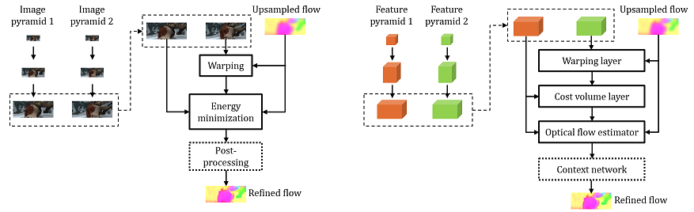

[](https://raw.githubusercontent.com/NVIDIA/FastPhotoStyle/master/LICENSE.md)


## PWC-Net: CNNs for Optical Flow Using Pyramid, Warping, and Cost Volume

### License
Copyright (C) 2018 NVIDIA Corporation. All rights reserved. Licensed under the CC BY-NC-SA 4.0 license (https://creativecommons.org/licenses/by-nc-sa/4.0/legalcode).


### Usage

For Caffe users, please refer to [Caffe/README.md](Caffe/README.md).

For PyTorch users, please refer to [PyTorch/README.md](PyTorch/README.md)

The PyTorch implementation almost matches the Caffe implementation (average EPE on the final pass of the Sintel training set: 2.31 by Pytorch and 2.29 by Caffe). 

### Network Architecture

PWC-Net fuses several classic optical flow estimation techniques, including image pyramid, warping, and cost volume, in an end-to-end trainable deep neural networks for achieving state-of-the-art results.




### Paper & Citation
[Deqing Sun, Xiaodong Yang, Ming-Yu Liu, and Jan Kautz. "PWC-Net: CNNs for Optical Flow Using Pyramid, Warping, and Cost Volume." CVPR 2018 or arXiv:1709.02371](https://arxiv.org/abs/1709.02371)

[Updated and extended version: "Models Matter, So Does Training: An Empirical Study of CNNs for Optical Flow Estimation." 	arXiv:1809.05571](https://arxiv.org/abs/1809.05571)

[Project page link](http://research.nvidia.com/publication/2018-02_PWC-Net:-CNNs-for)

[Talk at robust vision challenge workshop](https://www.youtube.com/watch?v=vVU8XV0Ac_0)

[Talk at CVPR 2018 conference](https://youtu.be/LBJ20kxr1a0?t=421)
 

If you use PWC-Net, please cite the following paper: 
```
@InProceedings{Sun2018PWC-Net,
  author    = {Deqing Sun and Xiaodong Yang and Ming-Yu Liu and Jan Kautz},
  title     = {{PWC-Net}: {CNNs} for Optical Flow Using Pyramid, Warping, and Cost Volume},
  booktitle = CVPR,
  year      = {2018},
}
```
or the arXiv paper
```
@article{sun2017pwc,
  author={Sun, Deqing and Yang, Xiaodong and Liu, Ming-Yu and Kautz, Jan},
  title={{PWC-Net}: {CNNs} for Optical Flow Using Pyramid, Warping, and Cost Volume},
  journal={arXiv preprint arXiv:1709.02371},
  year={2017}
}
```
or the updated and extended version
```
@article{Sun2018:Model:Training:Flow,
  author={Sun, Deqing and Yang, Xiaodong and Liu, Ming-Yu and Kautz, Jan},
  title={Models Matter, So Does Training: An Empirical Study of CNNs for Optical Flow Estimation},
  journal={IEEE Transactions on Pattern Analysis and Machine Intelligence (TPAMI)},
  note = {to appear}
}
```
For multi-frame flow, please also cite
```
@inproceedings{ren2018fusion,
  title={A Fusion Approach for Multi-Frame Optical Flow Estimation},
  author={Ren, Zhile and Gallo, Orazio and Sun, Deqing and Yang, Ming-Hsuan and Sudderth, Erik B and Kautz, Jan},
  booktitle={Proceedings of the IEEE Winter Conference on Applications of Computer Vision (WACV)},
  year={2019}
}
```
### Related Work from NVIDIA 
[flownet2-pytorch](https://github.com/NVIDIA/flownet2-pytorch)

[Learning Rigidity in Dynamic Scenes with a Moving Camera for 3D Motion Field Estimation (ECCV 2018)](https://github.com/NVlabs/learningrigidity)

### Contact
Deqing Sun (deqing.sun@gmail.com)


